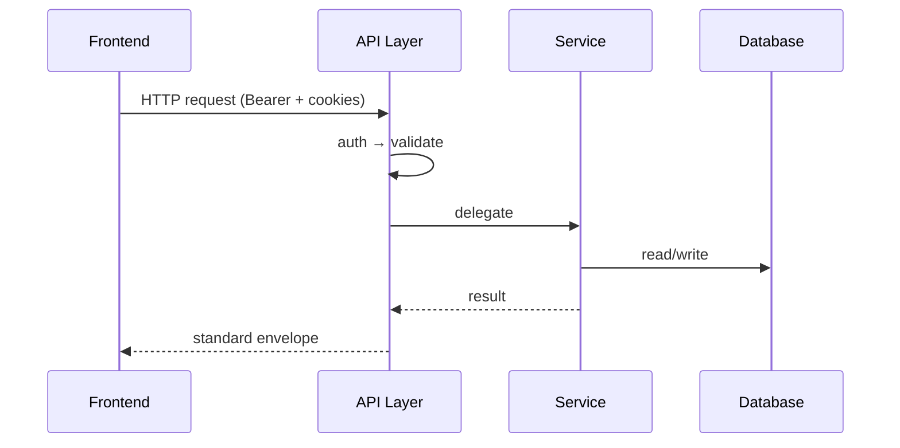
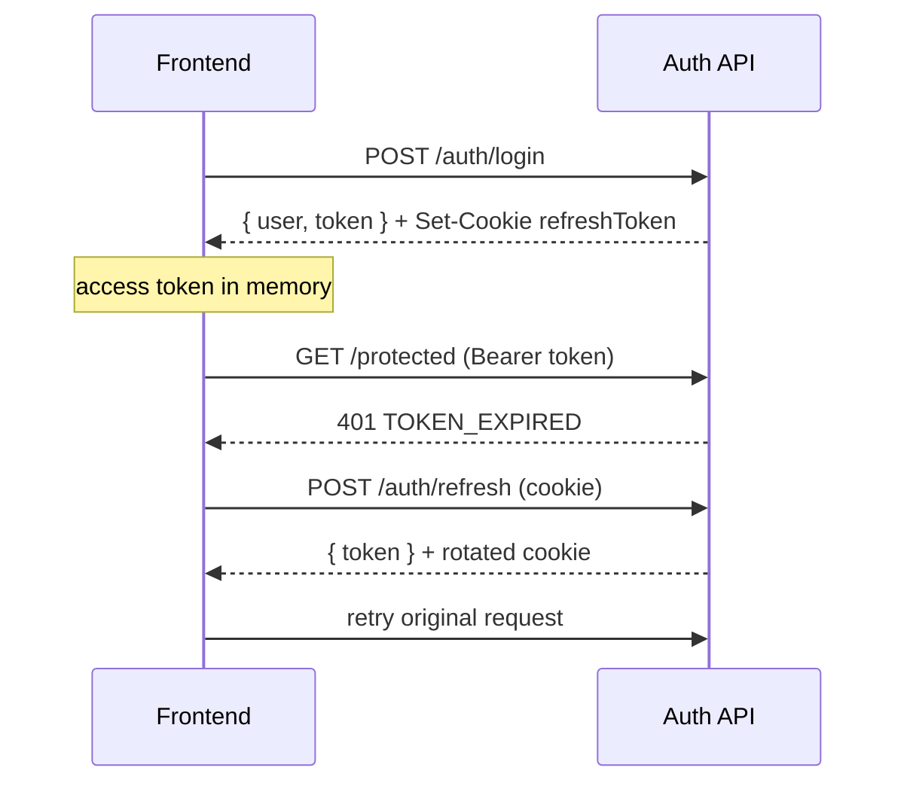

# Best in Flights Booking — Architecture Decision Document

| Field | Value |
|---|---|
| Project | `Best in Flights Booking` |
| Version | v1.0 |
| Architecture pattern | Monorepo · Modular Monolith (backend) |
| Last updated | 2026-09-03 |
| Author | Engineering Team |
| Status | **Approved** |
| Related docs | `docs/01-requirements/*`, `docs/03-database/*`, `docs/04-api/*` |

---

## 1. Key architectural decisions

| Decision | Choice | Reason |
|---|---|---|
| Overall pattern | Modular monolith (npm workspaces) | Fast v1 delivery; single deploy unit; clear module boundaries |
| Frontend architecture | Feature-Sliced Design (FSD) | Predictable imports; scalable search + booking + account UI |
| Backend architecture | Express modular monolith | Thin controllers; testable services; team familiarity |
| Database | MongoDB (Mongoose) | Flexible schema for users, bookings, passengers, and fare snapshots |
| API style | REST (`/api/v1`) | Standard envelope; easy client integration |
| Auth strategy | JWT access (memory) + httpOnly refresh cookie | Secure refresh; no tokens in localStorage |
| State management (frontend) | Redux Toolkit + TanStack Query + React Hook Form | Redux for client/UI state; Query for server state; RHF for forms |
| Styling | Tailwind CSS v4 + global design system (`global.css`) | Utility speed + single file for tokens and component classes |
| File storage | None (v1) | Tickets / invoices not required for auth scaffold |
| Cache | None (v1) | Add Redis in v2 for short-lived fare quotes |
| Logging | Pino (structured stdout) | Fast; JSON-friendly for production |

---

## 2. Frontend architecture

### Pattern

Feature-Sliced Design — import only from layers below.

```text
app/        → providers, store setup, global styles, router
pages/      → route-level composition (no business logic)
widgets/    → composite UI blocks (header, layout)
features/   → user actions (login, register)
entities/   → business nouns (user) + Redux slices per entity
shared/     → apiClient, auth token store, Redux hooks, UI primitives, eventBus
```

### Why this pattern

| Alternative considered | Why not chosen |
|---|---|
| Flat `components/` folder | Becomes unmaintainable as search, checkout, and account grow |
| Redux-only for all state | Mixes server cache with UI state; harder to invalidate API data |

### State management rules

| State type | Tool | Examples |
|---|---|---|
| Server/API data | TanStack Query | Lists, detail views, mutations |
| Client/UI global state | Redux Toolkit | Logged-in user, theme, sidebar open |
| Form input | React Hook Form + Zod | Login, register, search, passenger forms |
| Ephemeral UI | `useState` | Dropdown open, modal visibility |
| Access token | In-memory module (`shared/auth/token-store`) | Short-lived JWT only — never localStorage |

**Redux rules:**
- One slice per entity in `entities/[entity]/model/*-slice.ts`
- Store configured in `app/store/index.ts`
- Typed hooks in `shared/store/hooks.ts` (`useAppDispatch`, `useAppSelector`)
- NEVER put server/API cache or form field state in Redux

### Styling rules

| Layer | Location | Purpose |
|---|---|---|
| Design tokens + component classes | `app/styles/global.css` | **Single source of truth** for colors, spacing, `.btn`, `.card`, `.field` |
| Tailwind integration | `app/styles/index.css` | Imports Tailwind + `global.css`; maps tokens to `@theme` |
| React components | `shared/ui/` | Thin wrappers using global CSS classes |

**To change app-wide design:** edit `frontend/src/app/styles/global.css` only.

### Cross-module communication

EventBus in `shared/kernel/event-bus.ts` — never direct feature-to-feature imports.

---

## 3. Backend architecture

### Pattern

```text
routes → authenticate → roleGuard → validate → controller → service → model
```

v2 adds `permissionGuard` when module permissions are implemented.

### Layer responsibilities

| Layer | Responsibility | Must not |
|---|---|---|
| Routes | HTTP mapping, middleware chain | Business logic |
| Controller | Request/response mapping, cookies | Direct DB access |
| Service | Business rules, orchestration | HTTP awareness |
| Model | Schema, indexes | External API calls |
| Validation | Zod request schemas | DB access |

### Why this backend shape

Modular monolith keeps ops simple for v1 while `modules/[name]/` folders allow future extraction to services if needed. Flight search, bookings, and payments stay in one API with role-gated routes. External GDS / aggregator calls live in the `flights` service layer (v2), not in controllers.

---

## 4. Communication flow

### Standard request lifecycle



### Auth token lifecycle



### External integrations

| Service | Purpose | Protocol |
|---|---|---|
| MongoDB | Primary data store | MongoDB wire protocol |
| Travinus | Realtime flight search and pricing | HTTPS REST (`GET /api/v2/flights/search`) |

v2: Travinus Partner Flight Search API for realtime prices. Booking records are stored locally until Travinus publishes a partner ticketing endpoint.

---

## 5. Security architecture

### Authentication flow

1. User submits credentials via login form (React Hook Form + Zod)
2. Server validates, returns `{ user, token }` and sets **httpOnly** `refreshToken` cookie
3. Client stores **access token in memory** only (`shared/auth/token-store`)
4. On `401 TOKEN_EXPIRED`, `apiClient` calls `POST /auth/refresh` with cookie, retries once
5. Logout clears refresh cookie; client clears memory token and Redux user state

### Authorization model

```text
authenticate     →  verifies Bearer JWT; attaches user (id, role) to req.user
roleGuard        →  checks req.user.role against allowed roles
validate         →  Zod schema on body/query/params
```

v2: `permissionGuard` for module permissions; never trust client-provided `role` or `userId`.

### Security controls

| Control | Implementation |
|---|---|
| Password hashing | bcrypt (12 rounds) |
| Access token storage | In-memory only (frontend) |
| Refresh token storage | httpOnly, SameSite=Lax, Secure in production |
| Rate limiting | Not yet (add at API gateway v2; especially login + flight search) |
| CORS | `FRONTEND_URL` with `credentials: true` |
| Input validation | Zod (frontend + backend) |
| Sensitive fields | `passwordHash` excluded from API responses (`select: false`) |

---

## 6. Scalability planning

### Current capacity (v1)

| Dimension | Target |
|---|---|
| Concurrent users | 100 |
| Data volume (year 1) | Low — auth + later bookings |
| Geographic regions | Single region |

### Scaling approach

| Phase | Strategy |
|---|---|
| v1 | Single Node process + managed MongoDB |
| v2 | Horizontal API replicas; Redis for short-lived fare quotes; CDN for public assets |

---

## 7. Performance decisions

| Area | Decision | Reason |
|---|---|---|
| List endpoints | Offset pagination (`page`, `limit`) | Prevent unbounded responses |
| Heavy reads | TanStack Query cache (frontend) | Reduce duplicate API calls |
| Bundle size | Vite code splitting (route-level) | Smaller initial load; public vs gated routes |
| CSS | Tailwind + global.css tokens | Small bundle; centralized theming |

---

## 8. Deployment architecture

| Environment | Branch | URL | Deploy trigger |
|---|---|---|---|
| Local | any | `localhost:5173` / `localhost:4000` | `npm run dev` |
| Staging | `staging` | TBD | CI on push |
| Production | `main` | TBD | CI on merge |

| Service | Provider |
|---|---|
| Frontend | TBD (Vercel recommended) |
| Backend | TBD (Railway / Render) |
| Database | MongoDB Atlas or local |

---

## Fill checklist (before development)

- [x] Stack choices confirmed with user
- [x] Auth flow documented end-to-end
- [x] Security controls listed
- [ ] Deployment targets defined
- [x] Architecture approved by stakeholder

---

## Changelog

| Version | Date | Author | Changes |
|---|---|---|---|
| v1.0 | 2026-09-03 | Engineering Team | Fill from stack defaults + flight booking domain |
