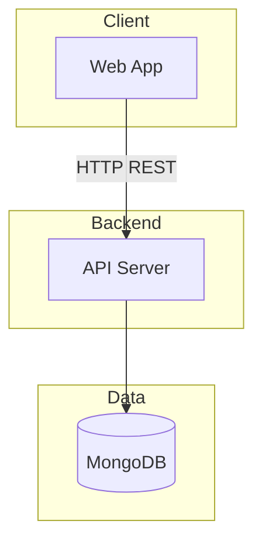
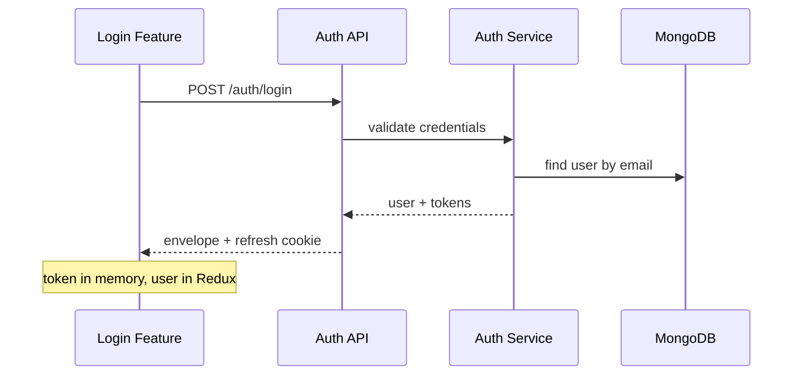
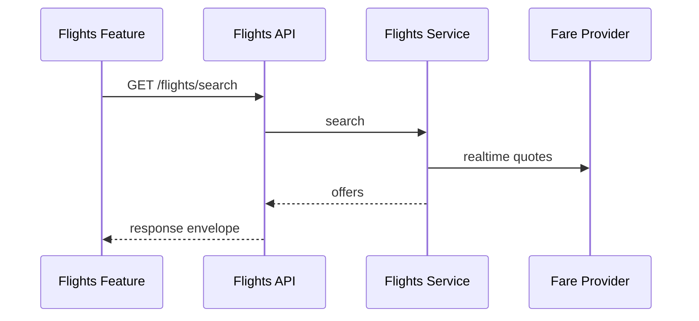

# Best in Flights Booking — Module Dependency Map

| Field | Value |
|---|---|
| Project | `Best in Flights Booking` |
| Version | v1.0 |
| Last updated | 2026-09-03 |
| Status | **Approved** |
| Related docs | `docs/02-architecture/architecture-decisions.md`, `docs/04-api/api-planning.md` |

---

## 1. Complete module list

### Core modules

| # | Module | Type | Description |
|---|---|---|---|
| M01 | `auth` | Core | Authentication, sessions, profile — **v1** |
| M02 | `flights` | Domain | Realtime search and fare quotes — **v2** |
| M03 | `bookings` | Domain | Create, view, cancel bookings — **v2** |
| M04 | `passengers` | Domain | Passenger details on a booking — **v2** |
| M05 | `payments` | Domain | Checkout and payment status — **v2** |

### Shared infrastructure (not business modules)

| Module | Responsibility |
|---|---|
| `shared/middleware` | auth, roleGuard, validate, errorHandler |
| `shared/config` | env validation, DB connection |
| `shared/logger` | Structured logging |
| `shared/kernel` (frontend) | eventBus for cross-feature events |
| `shared/store` (frontend) | Typed Redux hooks (`useAppDispatch`, `useAppSelector`) |
| `shared/auth` (frontend) | In-memory access token store |
| `app/store` (frontend) | Redux `configureStore` |
| `app/styles/global.css` (frontend) | Design tokens and global component classes |

---

## 2. Module relationships

### Dependency hierarchy

```text
                         ┌─────────────┐
                         │    auth     │
                         └──────┬──────┘
                                │
                                ▼
                         ┌─────────────┐
                         │   flights   │
                         └──────┬──────┘
                                │
                                ▼
                         ┌─────────────┐
                         │  bookings   │
                         └──────┬──────┘
                     ┌──────────┴──────────┐
                     ▼                     ▼
              ┌─────────────┐       ┌─────────────┐
              │ passengers  │       │  payments   │
              └─────────────┘       └─────────────┘
```

Search (`flights`) does not require login in v2. Creating a booking requires `auth`. Passengers and payments attach to a booking.

### Dependency matrix

| Module | Depends on | Depended on by |
|---|---|---|
| `auth` | — | All protected modules |
| `flights` | — (public search) | `bookings` |
| `bookings` | `auth`, `flights` | `passengers`, `payments` |
| `passengers` | `auth`, `bookings` | — |
| `payments` | `auth`, `bookings` | — |

No circular dependencies.

---

## 3. Execution priority (build order)

### Phase 1 — Foundation (v1)

```text
1. auth           → JWT, refresh cookie, roles, middleware
2. shared infra   → logger, error handler, apiClient, env, global.css, Redux store
3. frontend shell → layout, routing, login + register features
```

### Phase 2 — Core domain (v2)

```text
4. flights        → Realtime search and fare quotes
5. bookings       → Create / list / cancel (depends on flights + auth)
6. passengers     → Passenger details (depends on bookings)
7. payments       → Checkout (depends on bookings)
```

### Phase 3 — Business features (v3)

```text
8. notifications  → Booking confirmation emails
9. ancillaries    → Seats, baggage, meals
10. admin-dashboard → Ops overview
```

### Phase 4 — Integrations & reporting

```text
11. gds-adapter   → External realtime pricing provider
12. reporting     → Booking and revenue reporting
```

---

## 4. Shared dependencies

### Backend packages (all modules)

| Package | Used by |
|---|---|
| Express | All routes |
| Mongoose | All models |
| Zod | All validators |

### Frontend packages (all features)

| Package | Used by |
|---|---|
| TanStack Query | Server/API data hooks |
| Redux Toolkit + react-redux | Client/UI global state (entity slices) |
| React Hook Form + Zod | All forms |
| shared `apiClient` | All HTTP calls |
| Tailwind CSS v4 | Utility classes via `index.css` |
| `global.css` | Design tokens and component classes (`.btn`, `.card`, etc.) |

### External services

| Service | Modules | Purpose |
|---|---|---|
| MongoDB | All | Primary data store |
| Travinus Partner Flight Search API v2 | `flights` | Realtime availability and pricing |

---

## 5. Internal communication rules

### Backend

- Modules call other modules via **service layer only** — never controller-to-controller.
- Cross-module side effects use **internal event emitter** (optional):

```text
bookingService.create()
  → eventBus.emit('booking:created', payload)
  → paymentService.initiate(payload)  // v2
```

### Frontend

- **No direct imports between feature slices.**
- Cross-feature events via `shared/kernel/eventBus`.
- Entity Redux slices from `entities/[name]/index.ts` only.
- Typed Redux hooks from `shared/store` only.
- Entity types from `entities/[name]/index.ts` or `shared-core`.
- **Never** put server state in Redux or form state in Redux.

---

## 6. External communication



v2 adds Travinus for realtime flight search. Booking is stored in our database from a cached Travinus offer (public Travinus docs currently publish search only).

---

## 7. Data flow (per critical action)

### Flow: User login



### Flow: Search flights (v2)



---

## Fill checklist

- [x] Every module from requirements is listed
- [x] Dependency matrix has no circular deps
- [x] Build order respects dependencies
- [x] External services identified

---

## Changelog

| Version | Date | Author | Changes |
|---|---|---|---|
| v1.0 | 2026-09-03 | Engineering Team | Flight booking domain modules from product brief |
